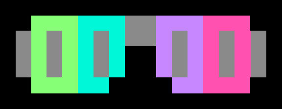

RGBShades countdown clock
=========================

## Overview

This is a ~~quick hack~~ modification of Macetech's demo software for [macetech's RGBShades](http://docs.macetech.com/doku.php/rgb_shades) + [Chronodot](https://www.adafruit.com/product/255) combo.

Macetech's instructions for how to combine them are here: [RGB Shades with ChronoDot
](http://docs.macetech.com/doku.php/rgb_shades_clock_using_chronodot)

I grabbed the demo software from that page and got the hardware working.

## Libraries you'll need:

* [FastLED](https://github.com/FastLED/FastLED)
* [Time](http://playground.arduino.cc/code/time) ([docs](http://www.pjrc.com/teensy/td_libs_Time.html))
* [DS1307RTC](https://www.pjrc.com/teensy/td_libs_DS1307RTC.html)

These are the same libraries you'll need for the regular RGBShades + ChronoDot sketch.

## Software Changes

The original RGBShades software is pretty cool, and the demo RGBShades+Chronodot software shows how to read the time and display it as scrolling text.

I had to set the ChronoDot's clock, and used the TimeSetRTC example program to do that.

### Simulated Seven-Segment Display

I didn't like the scrolling text, so I removed the code for that font and the effects that used it. I replaced that with a simulated seven-segment-display font, so the display could show a stationary time, like an alarm clock or digital watch.

There's a bit of a challenge there due to the shape of the RGBShades' LED array: the font is 3x5, but there aren't enough LED pixels to fully fit four numerals. I placed them one pixel apart on each side and the missing pixels looked bad.

To fix this, I put the numerals side by side with no margin, and that looked bad too.

To fix that, I made them different colors, so it's easy to distinguish the adjacent numerals. The colors are randomly chosen, but the hues are at least 45 degrees apart on the color wheel.

So that's what the clock looks like.

### Countdown features

The idea for this project was to replace single-use plastic New Year's Eve glasses with a configurable version, so the clock has a special countdown feature near midnight. The code assumes that the RTC's time is set in the local time zone, so midnight for the RTC is what triggers the special effects.

In [utils.h](utils.h), the setSpecialTimeCode function looks at the current time and sets specialTimeCode to NORMAL_TIME, COUNTDOWN_TIME, or CONFETTI_TIME. 

NORMAL_TIME shows hours and minutes (in 12-hour format).

COUNTDOWN_TIME is from 11:50pm to midnight, and counts down minutes and seconds to midnight.

CONFETTI_TIME is from midnight to 12:01 AM, and shows the confetti effect.

### Hardware comfort note
The ChronoDot I got came with headers installed, so it can easily be plugged into a breadboard.

This also means that if you mount it on the right earpiece as shown in the [macetech photo](http://docs.macetech.com/doku.php/rgb_shades_clock_using_chronodot), the header pins will poke you in the head. You'll need to desolder them (or bend the pins out of the way) before you mount it.

